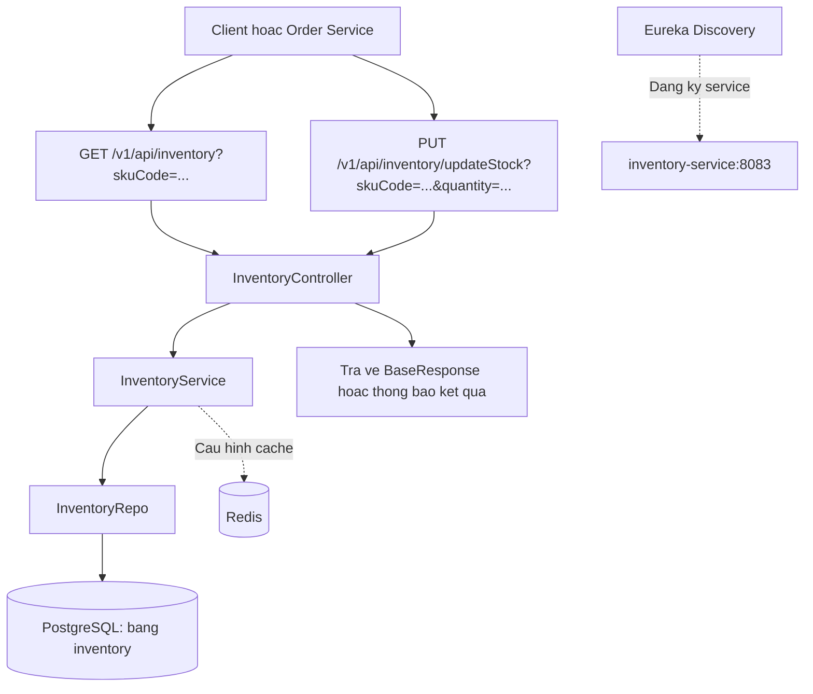
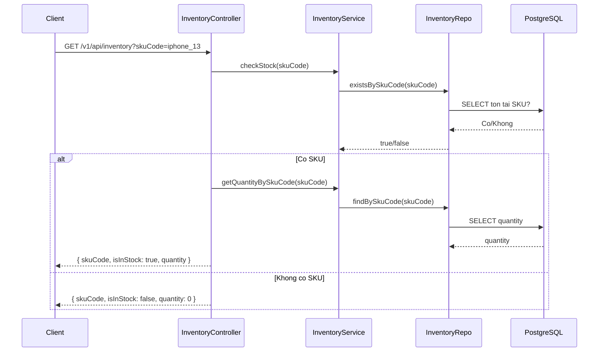
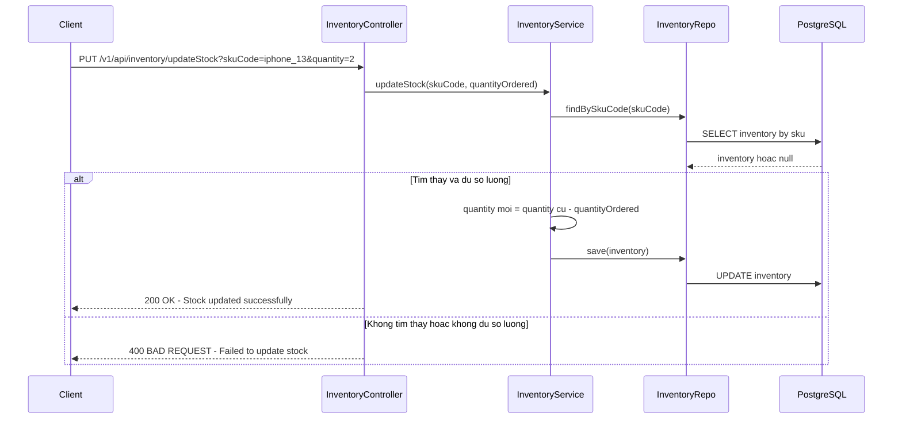

# Huong dan co ban ve Microservices va Spring Boot (cho nguoi moi)

Tai lieu nay giai thich dua tren cau truc that cua du an trong thu muc:
`Practice/BT4/microservices_api_demo`

Muc tieu: giup ban hieu duoc microservices la gi, Spring Boot dung de lam gi, va du an nay dang duoc bo tri ra sao.

---

## 1) Microservices la gi?

Microservices la cach chia mot he thong lon thanh nhieu "dich vu nho" (service), moi service phu trach mot viec ro rang.

Vi du trong du an nay:
- `product-service`: quan ly san pham
- `inventory-service`: quan ly ton kho
- `order-service`: tao don hang
- `notification-service`: gui thong bao
- `api-gateway`: cong vao chung cho client
- `discovery-server`: noi cac service tim thay nhau

Neu lam theo kieu "mot khoi lon" (monolith), tat ca nam trong 1 app duy nhat. Microservices thi tach ra thanh nhieu app nho.

### Loi ich chinh
- De mo rong tung phan (service nao tai cao thi scale service do).
- De bao tri hon khi he thong lon.
- De phan chia cong viec theo nhom.

### Kho khan chinh
- Van hanh phuc tap hon (nhieu service, nhieu cong cu).
- Can quan ly giao tiep giua cac service.
- Can monitoring va tracing tot de debug.

---

## 2) Spring Boot la gi?

Spring Boot la framework giup tao ung dung Java backend nhanh, it cau hinh thu cong.

No giup ban:
- Tao REST API nhanh (`@RestController`, `@GetMapping`, `@PostMapping`)
- Ket noi DB (JPA, MongoDB)
- Cau hinh bao mat
- Theo doi suc khoe ung dung (Actuator)

Trong du an nay, moi service la mot ung dung Spring Boot rieng.

---

## 3) Cau truc du an nay dang trien khai nhu the nao?

Du an dung Maven multi-module (xem file `pom.xml` o muc goc cua `microservices_api_demo`).

Cac module chinh:
- `product-service`
- `order-service`
- `inventory-service`
- `notification-service`
- `discovery-server`
- `api-gateway`

Ngoai ra co `docker-compose.yml` de chay them cac thanh phan ha tang:
- Kafka (3 broker) + Kafka UI
- Redis
- MongoDB
- PostgreSQL
- Keycloak
- Zipkin
- Prometheus

Dieu nay cho thay du an dang theo huong microservices kha day du: co service discovery, gateway, auth, message broker, cache, monitoring, tracing.

---

## 4) Vai tro tung thanh phan trong du an

### 4.1 API Gateway (`api-gateway`)
- La "cua vao" chung cho client.
- Dinh tuyen request den service ben trong.
- Trong cau hinh hien tai:
  - `/v1/api/product` -> `product-service`
  - `/v1/api/order` -> `order-service`
- Co cau hinh OAuth2 Resource Server de kiem tra JWT.

**Tu chuyen nganh:**
- Gateway: cong trung gian nhan request tu ben ngoai, roi chuyen vao service ben trong.
- JWT: chuoi token mang thong tin dang nhap/phan quyen.

### 4.2 Discovery Server (`discovery-server`)
- Su dung Eureka de dang ky va tim service.
- Cac service khac se "dang ky" len day.

**Tu chuyen nganh:**
- Service Discovery: co che de cac service tim dia chi cua nhau dong, khong can hard-code IP/port.

### 4.3 Product Service (`product-service`)
- Quan ly thong tin san pham.
- Dang dung MongoDB (`spring.data.mongodb.uri=...`).

### 4.4 Inventory Service (`inventory-service`)
- Quan ly ton kho.
- Dung PostgreSQL cho du lieu ton kho.
- Dung Redis de cache.

**Tu chuyen nganh:**
- Cache: bo nho tam de doc nhanh hon, giam tai database.

### 4.5 Order Service (`order-service`)
- Tao don hang.
- Dung PostgreSQL.
- Co cau hinh Resilience4j (circuit breaker, retry, timeout) de tang do on dinh khi goi service khac.

**Tu chuyen nganh:**
- Circuit Breaker: tam "ngat" goi toi service dang loi de tranh lam he thong xau hon.
- Retry: thu goi lai khi loi tam thoi.
- Timeout: gioi han thoi gian cho mot lan goi.

### 4.6 Notification Service (`notification-service`)
- Nhan su kien tu Kafka va gui thong bao (co cau hinh mail).
- Khong dung database rieng trong cau hinh hien tai.

### 4.7 Kafka
- Dung de giao tiep bat dong bo (asynchronous).
- Vi du: tao don thanh cong thi phat event, notification-service tieu thu event de gui mail.

**Tu chuyen nganh:**
- Asynchronous: gui thong diep khong can cho ben kia xu ly xong ngay.
- Producer: ben gui message len Kafka.
- Consumer: ben nhan message tu Kafka.

### 4.8 Keycloak
- He thong quan ly danh tinh va dang nhap (Identity Provider).
- Cap token OAuth2/OIDC de Gateway va service xac thuc.

### 4.9 Zipkin va Prometheus
- Zipkin: theo doi 1 request di qua nhieu service (distributed tracing).
- Prometheus: thu thap metrics de giam sat he thong.

---

## 5) Luong xu ly vi du de de hieu

Vi du nguoi dung dat hang:

1. Client gui `POST /v1/api/order` vao Gateway.
2. Gateway kiem tra token JWT hop le.
3. Gateway chuyen request sang `order-service` (theo route).
4. `order-service` co the goi `inventory-service` de kiem tra ton kho.
5. Neu hop le, `order-service` luu don vao PostgreSQL.
6. `order-service` phat su kien len Kafka.
7. `notification-service` nhan su kien, gui thong bao email.
8. Metrics/traces duoc day len Prometheus/Zipkin de quan sat.

Nhin theo cach don gian: Gateway -> Order -> Inventory -> DB + Kafka -> Notification.

---

## 6) Giai thich cac tu de nham lan (cho nguoi moi)

- `Monolith`: 1 app lon lam tat ca.
- `Microservice`: nhieu app nho, moi app mot nghiep vu.
- `REST API`: cach backend mo endpoint de frontend/goi HTTP.
- `Endpoint`: duong dan API, vi du `/v1/api/product`.
- `Load balancing`: phan tai request qua nhieu instance.
- `lb://service-name`: kieu URI thong qua Discovery + load balancing.
- `Actuator`: endpoint quan sat he thong (`/actuator/...`).
- `Tracing`: theo dau duong di request qua cac service.

---

## 7) Tai sao du an nay la vi du tot de hoc?

Ban se hoc duoc ca 2 phan:
- Phan code service bang Spring Boot.
- Phan kien truc microservices thuc te (gateway, discovery, kafka, auth, cache, monitoring).

No khong chi la CRUD co ban, ma co them cac thanh phan ma he thong thuc te thuong can.

---

## 8) Goi y cach hoc cho nguoi moi (thuc te)

1. Hoc service don truoc: `product-service` (de hieu API + MongoDB).
2. Hoc tiep `order-service` + `inventory-service` (de hieu luong don hang).
3. Sau do hoc Gateway + Discovery (de hieu dinh tuyen va tim service).
4. Cuoi cung moi hoc Kafka, Keycloak, Zipkin, Prometheus.

Neu hoc theo thu tu nay, ban se de theo hon rat nhieu so voi hoc tat ca cung luc.

---

## 9) Luu y ve thong tin trong tai lieu

Tai lieu nay duoc viet dua tren:
- Cac module trong `pom.xml`
- Cau hinh trong `docker-compose.yml`
- Cac file `application.properties` cua tung service

Nen noi dung bam sat du an hien co, khong them tinh nang "tuong tuong".

---

## 10) So do Inventory Service (cho nguoi moi)

### 10.1 So do tong quan

### 10.2 So do luong kiem tra ton kho

### 10.3 So do luong tru kho (update stock)

### 10.4 Cach doc so do trong 30 giay

1. Moi request vao `InventoryController`.
2. Controller khong xu ly truc tiep, ma goi `InventoryService`.
3. `InventoryService` goi `InventoryRepo` de doc/ghi PostgreSQL.
4. Ket qua duoc tra ve dang JSON (`BaseResponse`) hoac chuoi thong bao.
5. Service nay co cau hinh Redis va Eureka, nhung logic chinh hien tai tap trung vao DB PostgreSQL.
